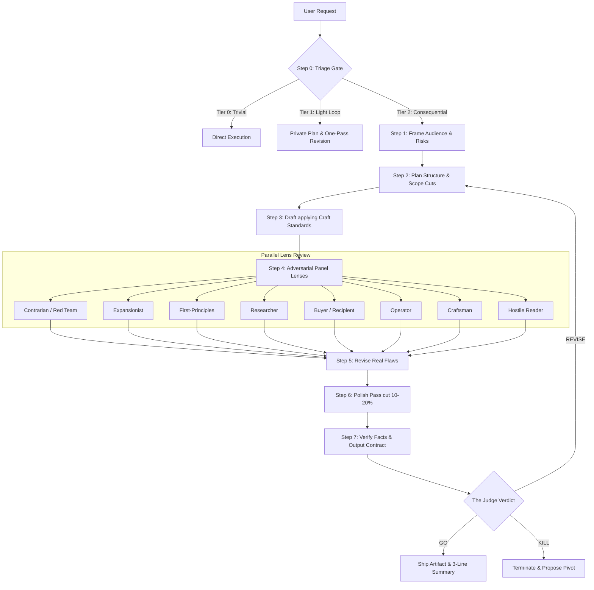

# ⚖️ Crucible: An Advanced LLM Quality & Calibration Harness

**Crucible** is a self-contained, prompt-grade execution harness designed to transform raw LLM generations into calibrated, production-grade outputs. Instead of accepting the first draft or relying on simple instruction following, Crucible wraps consequential tasks in a rigorous multi-stage loop: framing requirements, structured planning, high-effort drafting, multi-perspective adversarial review, and strict validation.

Originally built as a post-generation review system, **Crucible v2.0.0** is a complete end-to-end quality harness governing how outputs are framed, built, critiqued, and verified.

---

## 🏗️ System Architecture

Crucible operates as a stateful generation pipeline. The following diagram illustrates the workflow:

---

## 🛠️ The 7-Step Quality Harness

Crucible structures reasoning into a strict sequential workflow:

1. **Frame**: Define the real audience, the success metric (revenue, correctness, durability), and the primary failure mode.
2. **Plan**: Formulate a structural plan including explicit "scope cuts" and key load-bearing decisions.
3. **Draft**: Produce a complete, high-effort implementation. Sketching or placeholders are banned.
4. **Panel**: Execute a multi-lens review targeting the drafted artifact.
5. **Revise**: Resolve critical findings in priority order without compromising the artifact's sharp edges.
6. **Polish**: Rerun a dedicated craft pass to trim 10–20% of fluff words, remove hedging, and format.
7. **Verify**: Check requirements coverage, verify or flag citations, test execution if applicable, and hand over to the **Judge** for final evaluation.

---

## 🔍 The Adversarial Panel Lenses

Crucible evaluates work through 8 distinct, specialized perspectives rather than generic critique:

| Lens | Role & Focus | Core Question |
| :--- | :--- | :--- |
| **Contrarian / Red Team** | Falsification & risk identification | *What has to be true for this to fail, and how likely is that?* |
| **Expansionist** | Scaling the upside & identifying opportunities | *What does this unlock—the second-order win or adjacent door?* |
| **First-Principles** | Stripping framing & verifying logical foundations | *What is actually true here from the ground up, and is this the right problem?* |
| **Researcher** | Fact-checking, citations, and prior art validation | *What does the outside world know, and does evidence support the claim?* |
| **Buyer / Recipient** | Audience empathy & objection modeling | *Would I actually care, pay, use, approve, or act on this?* |
| **Operator** | Iterative reduction & execution scoping | *What is the smallest thing we can ship or test this week?* |
| **Craftsman** | Visual, architectural, and structural quality review | *Would the best practitioner in this domain sign their name to this?* |
| **Hostile Reader** | Mitigating misinterpretation & bad-faith criticism | *How will this be misread, quoted out of context, or used against the author?* |

---

## ⚡ Portability Notes (Multi-LLM Deployment)

Crucible is designed to work across a variety of runtime architectures:

*   **Sub-agent / Multi-agent Environments** (*e.g., Claude Code, Agent SDKs*): Execute lenses as parallelized independent agents that only see their lens brief and the artifact to prevent cognitive drift.
*   **Frontier Chat Models with Hidden Reasoning** (*e.g., Gemini Flash/Pro, o1/o3*): Run the framing, planning, and panel steps entirely inside private reasoning space, surfacing only the final output contract to the user.
*   **Local or Smaller Models** (*e.g., Llama-3, Mistral*): Run the loop visibly but compactly. Explicitly output section headings `[PLAN]`, `[DRAFT]`, `[PANEL]`, `[FINAL]`, and instruct the user to focus on `[FINAL]`. Making the scaffolding visible helps weaker models self-correct.
*   **Offline Environments**: The Researcher lens must flag every external statistic or figure as `"estimate, unverified"` and state what would be queried, preventing hallucination.

---

## 📈 Changelog

### v2.0.0 (Current Release)

This release elevates Crucible from a review-only critique step to a complete, stateful execution harness:

*   **Harness Transformation**: Shifted from a review-only judge format to an end-to-end 7-step generation harness: `Frame → Plan → Draft → Panel → Revise → Polish → Verify`.
*   **Craft Standards Integration**: Injected rigid taste rubrics for four core domains (Writing, Code, Design, and Analysis) to elevate baseline outputs on weaker models.
*   **Expanded Roster**: Introduced the **Craftsman** (quality/detail checks) and **Hostile Reader** (misinterpretation analysis) lenses.
*   **Portability Modes**: Formalized degradation configurations for sub-agent networks, hidden reasoning environments, local/offline models, and search-disabled runtimes.
*   **Behavioral Controls**: Added active suppression rules for common LLM failure modes:
    *   *Effort Theater* (excessive ceremony on trivial requests).
    *   *Lazy Draft / Heroic Panel* (deliberate low-effort drafting relying on review self-correction).
    *   *Beige Revision* (sanding off creative/innovative edges to fit generic feedback).
*   **Manual Overrides**: Added explicit prompt triggers (`crucible this`, `polish pass`, `hostile read`, etc.) to force specific loops.

---

## 📝 License

This project is licensed under the MIT License - see the [LICENSE](./LICENSE) file for details.
